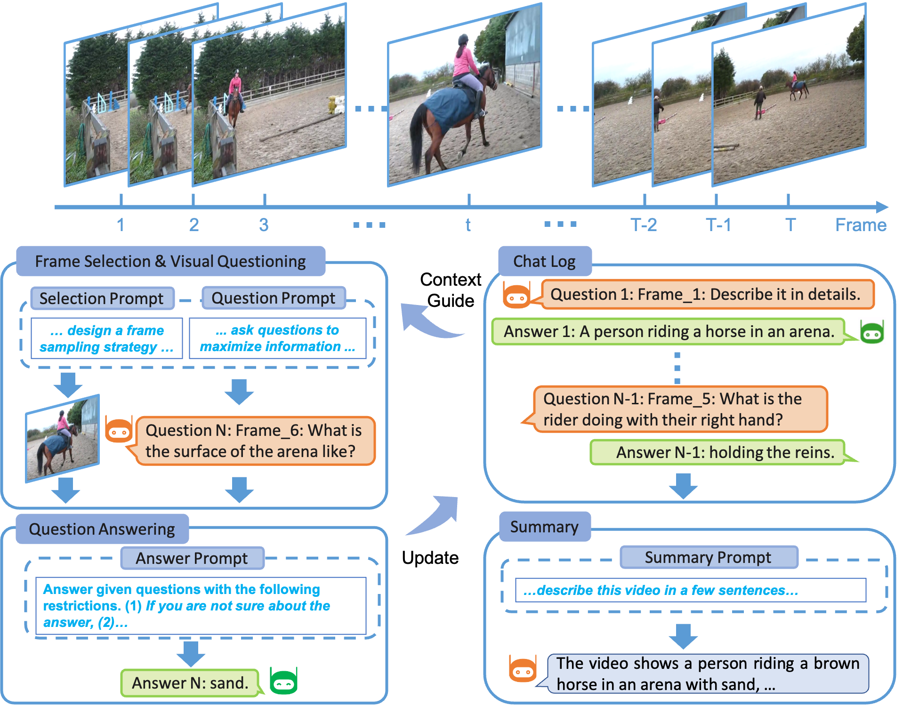

# Video ChatCaptioner: Towards the Enriched Spatiotemporal Descriptions

Official repository of **Video ChatCaptioner**.

<!-- ## Demo -->


## System Architecture



## Installation
Note that you need a GPU with 24G memory to run ChatCaptioner due to the size of BLIP-2.

To start, git clone this repository first.

To install and activate the environment, run the following command:

```
conda env create -f environment.yml
conda activate chatcap
```

Set the environment variable OPENAI_API_KEY to your OpenAI API Key. 

```
export OPENAI_API_KEY=Your_OpenAI_Key
```
You can add it to .bashrc so you don't need to set it manually everytime.


As many scripts here are in jupyter notebook, don't forget to add the environment to jupyter's kernel list. 
To do so, run

```
python -m ipykernel install --user --name=chatcap
```


To play with Video ChatCaptioner with a few dataset samples on msvd videos

```
sh run_msvd.sh
```

To play with Video ChatCaptioner with a few dataset samples on webvid videos

```
sh run_webvid.sh
```


<!-- 
```
# caption all the sampled images in the datasets 'cc_val' and 'artemis' using GPU-0 and save results to experiments/test
python main_caption.py --exp_tag test --datasets cc_val artemis  --device_id 0
``` -->


## Acknowledgement

+ [ChatGPT](https://openai.com/blog/chatgpt/)
+ [BLIP2](https://huggingface.co/docs/transformers/main/model_doc/blip-2)

Please cite Video ChatCaptioner from the following bibtex
